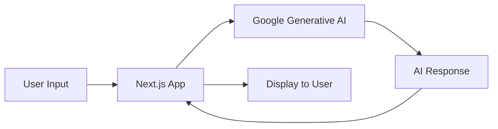

# AI Fitness Trainer Chatbot

## Project Overview

The AI Fitness Trainer Chatbot is a Next.js application that uses Google's Generative AI to provide 24/7 personalized fitness advice. This project was chosen to create an always-available personal trainer that delivers accurate and appropriate fitness guidance.

## Technical Stack

| Component | Technology |
|-----------|------------|
| Frontend  | Next.js    |
| AI Model  | Google Generative AI |
| Styling   | Tailwind CSS |

## Setup and Deployment
- Overview 
    set up was done by first creating next app using the command 
    ```
    create-next-app "app name"
    ```
    and after creating the app and allowinf all the required files like routing,css,typescript file 
    to add node modules we use the command npm install or npm i which downloads all the dependencies required to create this app
    to deploy it on our local host we use the command npm run dev which starts our next app on the port selected in my case its locolhost:3000
    and for deploying it on the internet we can use the free resources of netlify too!

### Prerequisites

- Node.js (v14 or later)
- Google Cloud account
- Google Generative AI API key

### Setup Steps

1. Clone the repository:
   ```
   git clone https://github.com/your-username/ai-fitness-trainer.git
   cd ai-fitness-trainer
   ```

2. Install dependencies:
   ```
   npm install
   ```

3. Create a `.env.local` file in the project root and add your API key:
   ```
   GOOGLE_AI_API_KEY=your_api_key_here
   ```

4. Run the development server:
   ```
   npm run dev
   ```

### Deployment

1. Build the project:
   ```
   npm run build
   ```

2. Deploy to your preferred hosting platform (e.g., Vercel, Netlify):
   ```
   npx vercel deploy --prod
   ```

## Key Features

- Real-time AI-powered fitness advice
- Personalized workout recommendations
- Nutrition guidance
- Exercise technique tips

## Project Structure

```
ai-fitness-trainer/
├── pages/
│   └── index.js    # Main application component
├── styles/
│   └── globals.css # Global styles
├── public/         # Static assets
├── .env.local      # Environment variables (git-ignored)
└── package.json    # Project dependencies and scripts
```

## Integration with Google Generative AI

The application integrates with Google's Generative AI using the following process:

1. Initialize the AI model on component mount
2. Send user input to the model for processing
3. Receive and display AI-generated responses



## Reasons for Project Choice

1. **24/7 Availability**: Unlike human trainers, the AI is always accessible.
2. **Personalized Advice**: The AI can tailor recommendations to individual needs.
3. **Broad Knowledge Base**: Covers various aspects of fitness, nutrition, and health.
4. **Scalability**: Can handle multiple users simultaneously.
5. **Continuous Learning**: The AI model can be updated with the latest fitness information.

## Future Enhancements

- User authentication for personalized fitness tracking
- Integration with wearable devices for real-time health data
- Expanding the AI's knowledge base with more specialized fitness topics
- Adding voice interaction capabilities
- saving the data from the user prompt for further analysis
- including a calories counter for each user to keep a track of food eaten

```
